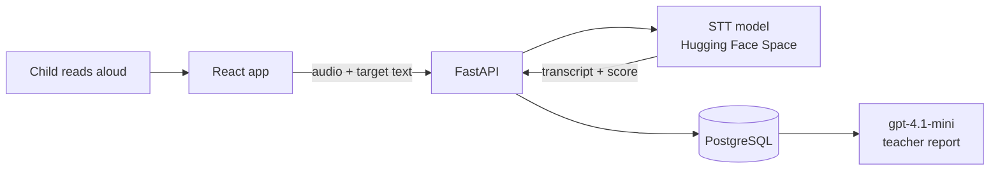

# VoiceLearn+ — speech-based reading & dictation coach for early readers

Children read sentences aloud or write down what they hear. A **speech-to-text model** scores their reading against the target sentence, and an **LLM turns the results into reports for teachers**. Built by team **RAVS** at **SmartHack 2025**.

## Problem

Children in the early grades need individual feedback on reading aloud and on dictation. Teachers rarely have time to give it to every student.

## How it works

- **Read Aloud.** The child reads a sentence and the frontend records it. The backend (`/analyze_audio`) sends the audio to the speech-to-text service, then returns the transcript and a similarity score against the target sentence.
- **Listen & Write.** The sentence is synthesized with `gpt-4o-mini-tts` (`/generate_audio`). The child types what they hear, and the answer is checked for spelling.
- **Teacher reports.** Results are stored in PostgreSQL. `gpt-4.1-mini` summarizes each student's error patterns into concrete recommendations (e.g. frequent homophone confusions → homophone exercises).
- **Privacy.** Audio is written to a temporary file only for the duration of the analysis, then deleted.
- **Gamified UI.** A mascot, confetti and a pop-the-balloon mini-game keep kids engaged.



## Speech-to-text & pronunciation scoring

The speech model runs in a Hugging Face Space ([`radu1633/learning-STT-RO`](https://huggingface.co/spaces/radu1633/learning-STT-RO)) built with Gradio and exposed to the backend as an API (`/analyze_audio_en`):

1. **Audio preprocessing:** ffmpeg converts any upload (MP3, WAV or even MP4 video) to 16 kHz mono PCM, the format Whisper expects.
2. **Transcription:** pretrained **Whisper `base`** through **faster-whisper** (CTranslate2) on CPU. The language is fixed to English, and `condition_on_previous_text=False` makes sure each recording is transcribed on its own.
3. **Phoneme-level scoring:** both the target sentence and the transcript are converted to IPA phonemes with **phonemizer** (eSpeak, en-US). The score is the normalized Levenshtein similarity between the two phoneme strings: `score = 1 − distance / max(len)`.

Comparing phonemes instead of letters means a homophone (*right* vs *write*) is not penalized as a pronunciation error, while a near miss (*ship* vs *sheep*) gets partial credit instead of zero.

## Tech stack

**Backend:** Python, FastAPI, SQLAlchemy, PostgreSQL, Docker Compose, Hugging Face Spaces (gradio_client), OpenAI API
**Frontend:** React, TypeScript, Vite, Tailwind CSS

## How to run

```bash
cd API
docker compose up -d                                                  # PostgreSQL 15 + Adminer on :8080
docker compose exec -T db psql -U smart -d smarthack < ../sentences.sql
docker compose exec -T db psql -U smart -d smarthack < ../students.sql
pip install -r requirements.txt
export OPENAI_API_KEY=...                                             # Windows PowerShell: $env:OPENAI_API_KEY="..."
uvicorn main:app --reload                                             # http://localhost:8000/docs
```

```bash
cd frontend
npm install
npm run dev
```

## What I'd improve

- **A truer pronunciation signal.** Whisper's language model tends to "correct" mispronounced words into real ones, so an ASR-based score can overrate pronunciation. A phoneme-recognition model (e.g. wav2vec2 trained on phonemes) or goodness-of-pronunciation scoring would measure what the child actually said.
- **Evaluation on children's speech.** Measure transcription accuracy and score reliability on children's voices, which are harder for models trained mostly on adult speech.
- **Concurrency.** The Space writes every upload to the same `/tmp` file, so simultaneous requests can overwrite each other. Each request should get its own temporary file.
- **Consistent API output.** The error branch returns values in a different order than the success branch, and the Gradio demo UI maps the outputs to the wrong fields.
- **Latency.** The Space's cold start delays the first request. The model could run inside the backend instead.
- **Code cleanup.** Read the database URL from an environment variable, import `HTTPException` from FastAPI instead of `http.client`, and remove duplicated imports and the committed `__pycache__/` folders.

## My contribution

Team project (RAVS). I owned the speech pipeline:

- **Speech-to-text:** set up and configured the STT model (Faster-Whisper) and deployed it as a Hugging Face Space ([`radu1633/learning-STT-RO`](https://huggingface.co/spaces/radu1633/learning-STT-RO)), which returns the transcript and a similarity score against the target sentence.
- **Text-to-speech:** configured speech synthesis (`gpt-4o-mini-tts`) for the Listen & Write mode, so every sentence is played back clearly to the child.
- **FastAPI integration:** connected both models to the backend through the `/analyze_audio` and `/generate_audio` endpoints, including temporary audio handling (recordings are deleted right after analysis).
